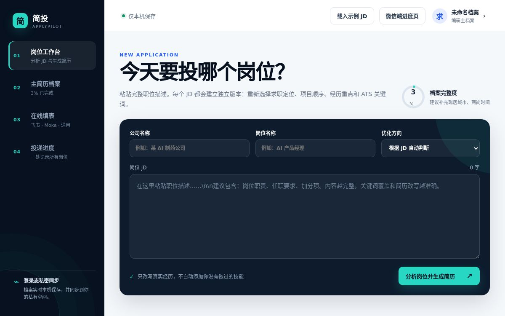

# 简投 ApplyPilot

> 维护一份真实主档案，为每个岗位生成一版针对性简历，并在本人确认后辅助填写招聘申请表。

[在线使用](https://applypilot-ai.meiqi011216.chatgpt.site) · [安装浏览器助手](https://applypilot-ai.meiqi011216.chatgpt.site/install.html) · [问题反馈](https://github.com/vousmetrove/applypilot-ai/issues)



## 产品概览

简投 ApplyPilot 是一套面向求职者的简历管理和投递辅助工具。它解决的核心问题是：求职者往往需要为不同岗位反复改简历、重复填写姓名、教育、经历和项目，还容易把通用简历投给所有岗位，遗漏 JD 中真正重要的要求。

ApplyPilot 将这套流程整理为一条可复用的工作流：

1. 只维护一次完整、真实的“主简历档案”。
2. 粘贴目标岗位的职位描述（JD）。
3. 查看关键词覆盖、硬性条件和证据缺口。
4. 生成该岗位专属的简历重点、顺序和 ATS 关键词。
5. 导出 Word 简历或结构化 JSON。
6. 在浏览器中辅助填写飞书招聘、Moka 和常见在线申请表。
7. 由本人核对附件、验证码、声明，并点击最终提交。
8. 在投递进度页记录后续的笔试、面试和 Offer 状态。

### 适合谁使用

| 用户 | 常见问题 | ApplyPilot 提供的帮助 |
|---|---|---|
| 校招和应届生 | 经历不多，不知道针对 JD 突出什么 | 对照 JD 找出现有经历中的有效证据，不虚构能力 |
| 同时申请多个方向的人 | 每个岗位都要重新调整简历 | 按 AI/产品、计算生物、实验研发、解决方案、运营等方向重新组织内容 |
| 高频投递者 | 重复填写教育、项目和联系方式 | 浏览器助手在用户点击后填写常见字段 |
| 使用飞书招聘或 Moka 的求职者 | 不同企业表单字段多且重复 | 提供常用字段映射、自定义问答和未识别字段提示 |
| 需要管理投递进度的人 | 岗位分散，容易忘记跟进 | 集中记录待投递、已投递、笔试、面试、Offer 等状态 |
| 希望自己部署的开发者 | 需要可审计、可扩展的开源基础 | 提供 Web 应用、API、D1/R2 数据层和 Manifest V3 扩展源码 |

## 功能与优势

### 一份事实档案，多岗位复用

主档案覆盖基本信息、求职意向、教育与课程、工作和科研经历、项目、技能、成果、材料库、自定义字段及敏感选填项。修改会先保存到当前浏览器；部署环境可进一步同步到登录用户的私有云端空间。

### 一岗一版，而不是简单替换关键词

系统会根据 JD：

- 判断岗位方向并给出匹配分数；
- 区分“主档案已有证据”和“JD 提到但档案没有证据”的关键词；
- 核对学历、专业、工作经验等硬性条件；
- 调整求职定位、个人摘要、项目顺序、经历重点和技能顺序；
- 保留缺口提示，不把不存在的技能写进简历。

### 多种可交付结果

一次分析后可以获得：

- 岗位分析与初筛建议；
- 浏览器内的定向简历预览；
- 可直接下载的 `.docx` Word 简历；
- 可复制的纯文本简历；
- 可复制或下载的结构化 JSON 投递数据。

### 表单辅助填写，保留最终控制权

浏览器助手支持 Manifest V3，可在桌面版 Chrome 和 Microsoft Edge 中使用；QQ 浏览器和夸克桌面版仅在当前版本支持加载 Chromium 扩展时可用。扩展只在用户点击后读取当前标签页，并且：

- 不读取浏览历史；
- 不保存招聘网站密码；
- 不绕过验证码；
- 不自动勾选承诺或真实性声明；
- 不自动填写身份证件号码等高敏感信息；
- 不自动点击最终提交。

### 手机与电脑配对

浏览器助手可以生成一次性二维码。用户用手机扫码并确认后，电脑端可同步主档案，也可以接收“同步档案、打开申请页、分析当前页、填写当前页”四类受控任务。除档案同步外，电脑端仍需点击执行。

### 材料库与投递追踪

- 材料库支持 PDF、DOC、DOCX、JPG 和 PNG，单个文件最大 20 MB。
- 投递状态支持：待投递、已投递、笔试、面试、Offer、已拒绝、已撤回。
- 微信内 H5 页面可查看投递记录、设备状态和浏览器活动。

> ApplyPilot 不是飞书、Moka 或微信的官方产品。外部招聘平台通常不提供统一的个人求职状态接口，因此提交结果和招聘进度需要用户核对后记录。

## 当前可用范围

| 能力 | 状态 | 说明 |
|---|---|---|
| 在线工作台 | 已可用 | 需要通过 ChatGPT 登录公开站点 |
| 主档案、JD 分析、定向简历 | 已可用 | 主档案内容必须由用户如实填写 |
| Word 和 JSON 导出 | 已可用 | 提交前应人工校对 |
| Chrome / Edge 本地扩展 | 已可用 | 目前通过 ZIP 手动加载 |
| QQ / 夸克桌面版 | 兼容性支持 | 取决于浏览器当前版本是否允许本地 Chromium 扩展 |
| 飞书、Moka、通用表单辅助填写 | Beta | 企业自定义字段可能仍需手工填写 |
| 设备扫码配对与撤销 | 已可用 | 配对码 10 分钟过期，仅能使用一次 |
| 微信内 H5 进度页 | 已可用 | 作为网页在微信内打开，每 15 秒刷新 |
| 浏览器商店一键安装 | 尚未上线 | 需完成各浏览器商店审核 |
| 微信公众号自动回复、主动通知 | 尚未上线 | 需认证服务号或小程序及官方凭据 |

## 使用前准备

### 直接使用在线版

请准备：

- 一个可用于登录公开站点的 ChatGPT 账号；
- 桌面版 Chrome 或 Microsoft Edge；
- 完整、真实的教育和经历信息；
- 至少一份目标岗位 JD；
- 如需扫码配对，再准备一部可打开链接或扫码的手机。

建议先整理以下材料，录入会更快：

- 中文或英文旧简历；
- 教育经历、主修课程、GPA 或成绩排名；
- 实习、工作、科研、校园活动和项目经历；
- 技能、证书、奖项、论文和作品集链接；
- 常用申请材料，例如成绩单、证书和证件照。

### 本地开发

请安装：

- [Git](https://git-scm.com/downloads)
- [Node.js](https://nodejs.org/) `22.13.0` 或更高版本
- Node.js 自带的 npm

检查版本：

```bash
git --version
node --version
npm --version
```

Windows PowerShell 如果提示禁止运行 `npm.ps1`，后续命令请把 `npm` 改为 `npm.cmd`，例如：

```powershell
npm.cmd ci
npm.cmd run dev
```

## 快速开始：直接使用在线版

不需要克隆源码，也不需要安装扩展，即可先完成主档案、JD 分析和简历导出。

### 第 1 步：打开工作台

访问 [简投 ApplyPilot](https://applypilot-ai.meiqi011216.chatgpt.site)，按照页面提示通过 ChatGPT 登录。登录成功后会进入“岗位工作台”。

### 第 2 步：建立主简历档案

1. 点击右上角的“编辑主档案”，或左侧的“主简历档案”。
2. 按页面分区填写信息。
3. 优先完成姓名、电话、邮箱、求职方向、教育、主要经历、项目、技能和摘要。
4. 课程、项目和经历请使用可验证的真实内容。
5. 对招聘网站常出现的个性化问题，可在“自定义字段”中按 `字段名=真实答案` 每行填写一项。
6. 身份证件号码等敏感项建议留空，在实际申请页面手工填写。
7. 点击“完成编辑”。页面也会实时保存，误点空白处或按 Esc 不会丢失内容。

页面顶部会显示档案完整度。完整度只表示推荐字段的完成比例，不代表一定符合某个岗位。

### 第 3 步：分析岗位 JD

1. 在“公司名称”填写目标公司。
2. 在“岗位名称”填写职位名称。
3. “优化方向”通常保持“根据 JD 自动判断”；已明确方向时也可以手动选择。
4. 将岗位职责、任职要求和加分项完整粘贴到“岗位 JD”。
5. 点击“分析岗位并生成简历”。

JD 越完整，关键词和硬性条件识别越可靠。不要只粘贴岗位标题。

### 第 4 步：检查分析结果

依次查看：

1. “岗位分析”：检查匹配度、已覆盖关键词、证据缺口和硬性条件。
2. “定向简历”：核对摘要、经历顺序、项目重点和技能顺序。
3. “结构化 JSON”：需要在其他工具中复用数据时复制或下载。
4. “投递进度”：确认系统已经为该 JD 建立“待投递”记录。

如果“JD 提及但尚无证据”中出现你真实做过的内容，请回到主档案补充证据后重新分析；如果确实没有相关经历，应保留缺口。

### 第 5 步：导出并校对简历

1. 在结果区点击“导出 Word”。
2. 打开生成的 `.docx` 文件。
3. 检查姓名、联系方式、时间、数字、项目表述和分页。
4. 根据公司要求调整文件名，例如 `[姓名]-[公司]-[岗位].docx`。
5. 保存最终版本后再上传到招聘网站。

## 安装浏览器助手

浏览器助手用于在用户主动点击后识别和填写当前招聘申请页。手机浏览器不能运行该桌面扩展。

### 第 1 步：下载安装包

选择任一方式：

- 打开 [安装向导](https://applypilot-ai.meiqi011216.chatgpt.site/install.html)，点击“直接下载安装包”；
- 直接下载 [applypilot-browser-assistant.zip](https://applypilot-ai.meiqi011216.chatgpt.site/applypilot-browser-assistant.zip)；
- 克隆仓库后使用其中的 `extension/` 文件夹。

下载后，将 ZIP 解压到固定位置，例如：

```text
[你的文档目录]/ApplyPilot/
└── extension/
    ├── manifest.json
    ├── popup.html
    └── ...
```

不要在安装后删除或移动 `extension` 文件夹，否则浏览器可能无法继续加载扩展。

### 第 2 步：在浏览器中加载

| 浏览器 | 打开扩展管理页 | 操作 |
|---|---|---|
| Chrome | 地址栏输入 `chrome://extensions` | 开启“开发者模式” → “加载已解压的扩展程序” |
| Microsoft Edge | 地址栏输入 `edge://extensions` | 开启“开发人员模式” → “加载解压缩的扩展” |
| QQ 浏览器桌面版 | 菜单中打开“应用中心/扩展管理” | 若有开发者模式，加载已解压的扩展 |
| 夸克浏览器桌面版 | 菜单中打开“扩展/插件管理” | 若当前版本允许本地扩展，加载已解压的扩展 |

选择解压后的 `extension` 文件夹。正确的文件夹中应直接看到 `manifest.json`。

加载完成后，把“简投 ApplyPilot 浏览器助手”固定到浏览器工具栏。QQ 或夸克若没有开发者模式或本地加载入口，请改用 Chrome 或 Edge。

### 第 3 步：配置服务地址

1. 点击工具栏中的“简投”图标。
2. 在“简投服务地址”填写：

```text
https://applypilot-ai.meiqi011216.chatgpt.site
```

3. 点击“保存并授权连接”。
4. 浏览器请求网站访问权限时，核对域名后确认。

服务地址只保存在扩展的本机存储中。更换服务地址会清除原设备令牌，需要重新配对。

### 第 4 步：连接自己的档案

1. 确保已经在在线工作台建立主档案。
2. 在扩展中点击“生成手机连接二维码”。
3. 用手机扫描二维码，或复制连接链接到手机打开。
4. 在手机页面完成登录。
5. 核对设备名称和授权范围。
6. 点击“确认连接这台电脑”。
7. 回到电脑等待扩展显示姓名和档案同步状态。

二维码和配对码在 10 分钟后失效，并且只能使用一次。过期后回到扩展重新生成即可。

## 使用浏览器助手填写申请表

### 标准流程

1. 在电脑浏览器打开目标公司的招聘申请页面。
2. 确认当前页面是要填写的表单，而不是登录页、验证码页或最终提交确认页。
3. 点击工具栏中的“简投”图标。
4. 检查扩展顶部识别的平台名称。
5. 点击“识别并填写当前页面”。
6. 查看扩展返回的已填写字段和缺失字段。
7. 在网页中逐项核对绿色标记的内容。
8. 手动填写未识别字段、敏感信息和企业自定义问题。
9. 手动选择并上传正确的简历和附件。
10. 手动完成验证码、承诺声明和签名。
11. 完整检查后，由本人点击最终提交。
12. 回到 ApplyPilot 的“投递进度”，将该岗位更新为“已投递”。

### 连接失败时的备用导入

如果扫码或云端同步暂时不可用：

1. 在工作台完成一次 JD 分析。
2. 打开“在线填表”或“结构化 JSON”。
3. 点击复制填表数据或复制 JSON。
4. 打开浏览器扩展。
5. 展开“连接失败时的备用导入”。
6. 粘贴数据并点击“仅保存到本机”。
7. 回到申请页，再点击“识别并填写当前页面”。

备用导入的数据只保存在当前浏览器本机。使用公共或他人电脑后，应在扩展中断开设备，并清理该浏览器的扩展数据。

## 管理材料、投递进度和设备

### 上传申请材料

1. 打开“主简历档案”。
2. 进入“证书与申请材料库”。
3. 选择 PDF、DOC、DOCX、JPG 或 PNG 文件。
4. 确认单个文件不超过 20 MB。
5. 点击“上传所选材料”。
6. 在材料列表检查文件名和类型。

ApplyPilot 不会擅自把材料上传到第三方招聘网站；在申请页选择附件时必须由本人确认。

### 更新投递状态

1. 分析 JD 后打开“投递进度”。
2. 为记录选择平台：待确认、飞书招聘、Moka 招聘或其他。
3. 填写实际申请页链接。
4. 根据真实进展选择状态。
5. 提交成功后再选择“已投递”，收到通知后再更新为笔试、面试或 Offer。

### 在微信中查看进度

1. 在手机微信中打开 [微信端进度页](https://applypilot-ai.meiqi011216.chatgpt.site/wechat.html)。
2. 完成登录。
3. 将页面加入微信收藏，或发送到文件传输助手以便下次打开。
4. 页面每 15 秒更新投递记录、设备状态和电脑活动。
5. 从手机发送任务后，在对应电脑的浏览器扩展中再次确认执行。

当前版本不会读取微信聊天记录，也没有默认启用公众号自动回复或主动消息通知。

### 撤销设备

可使用任一方式：

- 在浏览器扩展中点击“断开当前设备”；
- 在工作台进入“在线填表 → 已连接设备”，找到设备后点击“撤销”。

设备丢失、使用公共电脑或怀疑令牌泄露时，应立即撤销设备。

## 本地安装与开发

### 第 1 步：克隆仓库

```bash
git clone https://github.com/vousmetrove/applypilot-ai.git
cd applypilot-ai
```

### 第 2 步：安装锁定版本的依赖

```bash
npm ci
```

不要用 `npm install` 随意更新锁定版本；需要升级依赖时，应检查并提交 `package-lock.json` 的对应变更。

### 第 3 步：启动开发服务器

```bash
npm run dev
```

本地预览请直接打开：

```text
http://localhost:5173/workspace.html
```

本地环境没有 ChatGPT Sites 注入的登录身份请求头，因此访问根路径 `/` 可能进入登录流程。`/workspace.html` 可用于开发界面、JD 分析、Word 导出和本机存储逻辑；云端同步、D1/R2 和完整设备配对需要部署环境。

### 第 4 步：验证修改

在 Windows、Linux 和 macOS 上可运行：

```bash
npm run lint
npm test
npm run extension:check
```

这些命令分别检查代码规范、执行生产构建和 7 项自动化测试、检查扩展 JavaScript 语法。

### 第 5 步：验证生产构建

```bash
npm run build
npm run start
```

根据终端给出的地址打开应用。停止服务器可按 `Ctrl+C`。

### 第 6 步：开发浏览器扩展

1. 在扩展管理页加载仓库中的 `extension/` 目录。
2. 修改 `extension/` 下的文件。
3. 运行：

```bash
npm run extension:check
```

4. 回到扩展管理页，点击该扩展的“重新加载”。
5. 重新打开申请页测试字段识别和填写。

不要用真实简历、账号或证件数据作为测试夹具。

### 第 7 步：生成数据库迁移

修改 `db/schema.ts` 后运行：

```bash
npm run db:generate
```

检查生成的 SQL，再提交迁移文件和相应的 `drizzle/meta` 文件。

### 第 8 步：发布前完整检查

完整发布检查会执行 lint、构建、测试、扩展语法检查、扩展打包和敏感信息扫描：

```bash
npm run release:check
```

该命令中的 ZIP 打包脚本需要 `bash`、`zip` 和 `unzip`。Linux 可直接运行；Windows 请在 WSL2 或 Git Bash 且已安装相应命令的环境中运行。

打包扩展：

```bash
npm run extension:package
```

输出文件为：

```text
public/applypilot-browser-assistant.zip
```

## 部署要求

当前公开服务使用 ChatGPT Sites/Cloudflare 运行环境。若要自行部署完整功能，需要提供：

- 用户身份请求头；
- Cloudflare D1 兼容数据库绑定 `DB`；
- Cloudflare R2 兼容对象存储绑定 `BUCKET`；
- HTTPS 域名；
- 用于身份、数据删除和隐私告知的运营配置。

本地构建会在 `.openai/hosting.json` 不存在时自动读取 `.openai/hosting.example.json` 的绑定名称。部署工具需要真实配置时，可先复制：

```bash
cp .openai/hosting.example.json .openai/hosting.json
```

Windows PowerShell 对应命令：

```powershell
Copy-Item .openai/hosting.example.json .openai/hosting.json
```

`.openai/hosting.json` 已被 `.gitignore` 排除，不要把真实部署标识提交到 GitHub。自行部署者还必须根据自己的运营主体、地区和基础设施更新 [PRIVACY.md](PRIVACY.md)。

## 常用命令

| 命令 | 用途 | 运行环境 |
|---|---|---|
| `npm run dev` | 启动开发服务器 | Windows / Linux / macOS |
| `npm run build` | 创建生产构建 | Windows / Linux / macOS |
| `npm run start` | 启动生产构建 | Windows / Linux / macOS |
| `npm run lint` | 执行 ESLint | Windows / Linux / macOS |
| `npm test` | 构建并运行 7 项测试 | Windows / Linux / macOS |
| `npm run db:generate` | 生成 Drizzle 数据库迁移 | Windows / Linux / macOS |
| `npm run extension:check` | 检查扩展脚本语法 | Windows / Linux / macOS |
| `npm run extension:package` | 生成扩展 ZIP | Bash + zip + unzip |
| `npm run public:package` | 生成公开源码快照 | Bash + git + zip + unzip |
| `npm run release:check` | 执行完整发布检查 | Linux / WSL2，或具备 GNU 工具的 Bash |

## 项目结构

| 目录 | 内容 |
|---|---|
| `app/` | 页面入口、认证逻辑和 API 路由 |
| `public/` | 工作台、安装向导、微信 H5、样式和扩展安装包 |
| `extension/` | Manifest V3 浏览器扩展源码 |
| `db/` | D1/SQLite 数据结构 |
| `drizzle/` | 数据库迁移及元数据 |
| `docs/` | 技术方案和产品边界说明 |
| `tests/` | 页面、扩展入口和组件测试 |
| `worker/` | Cloudflare Worker 入口 |
| `scripts/` | 构建、检查和发布脚本 |

## FAQ 与故障排查

### 打开在线版后为什么要求登录？

公开站点使用登录身份隔离不同用户的档案、附件、设备和投递记录。请完成 ChatGPT 登录后再进入工作台。

### 本地访问根路径为什么跳到登录页？

根路径依赖部署平台注入的身份请求头。本地开发请直接打开 `http://localhost:5173/workspace.html`。此时界面和本机存储功能可用，云端同步可能显示“仅本机保存”。

### 浏览器提示“清单文件缺失”或无法加载扩展怎么办？

你选择的目录层级不正确。请进入解压目录，并选择内部直接包含 `manifest.json` 的 `extension` 文件夹。

### QQ 浏览器或夸克浏览器找不到“加载已解压扩展”怎么办？

不同版本的入口和支持范围不同。如果扩展管理页没有开发者模式或本地加载按钮，请使用最新版 Chrome 或 Microsoft Edge。

### “识别并填写当前页面”按钮为什么不可用？

先检查扩展是否已经：

1. 保存并获得服务域名访问权限；
2. 通过扫码连接档案，或通过备用导入保存了填表数据；
3. 打开了一个普通的 `http://` 或 `https://` 招聘申请页。

浏览器内部页面、扩展商店页面和设置页不能注入填表脚本。

### 二维码显示过期怎么办？

配对码有效期为 10 分钟且只能使用一次。关闭旧二维码，在扩展中重新点击“生成手机连接二维码”。

### 更换服务地址后为什么需要重新配对？

这是预期的安全行为。扩展会清除属于旧服务的设备令牌，防止把原令牌发送到另一个域名。

### 为什么有些字段没有被自动填写？

飞书、Moka 和企业自建系统都可以添加自定义字段。ApplyPilot 会列出未识别项，但不会猜测答案。可把常见问题按 `字段名=真实答案` 加入主档案的“自定义字段”，其余内容请手工填写。

### 为什么附件、验证码和最终提交不能自动完成？

这些步骤可能涉及账号安全、敏感文件和法律声明。ApplyPilot 刻意保留人工确认，以防错传材料、错误承诺或误投岗位。

### Word 简历已经生成，为什么还要校对？

自动重排无法替代本人对事实、时间、数字和岗位适配性的最终判断。至少检查联系方式、日期、量化结果、分页、文件名和目标公司。

### 微信小助手会读取聊天记录吗？

不会。当前能力是一个可在微信中打开的 H5 进度页，以及扫码连接页面。公众号自动回复和主动消息推送尚未上线。

### `npm run release:check` 在 Windows 报找不到 `bash`、`zip` 或 `unzip` 怎么办？

先运行跨平台检查：

```powershell
npm.cmd run lint
npm.cmd test
npm.cmd run extension:check
```

需要完整发布打包时，请在 WSL2 中安装 `zip` 和 `unzip` 后再运行 `npm run release:check`。

### 如何删除数据或报告安全问题？

一般使用问题请提交 [GitHub Issue](https://github.com/vousmetrove/applypilot-ai/issues)。涉及个人信息、数据删除或安全漏洞时，请使用 [GitHub 私密安全报告](https://github.com/vousmetrove/applypilot-ai/security/advisories/new)，不要在公开 Issue 中粘贴个人数据。

## 隐私与安全边界

请勿把以下内容提交到 GitHub、Issue 或测试数据中：

- 真实求职者简历、身份证件或成绩单；
- 手机号、私人邮箱、住址等个人信息；
- `.env`、`.dev.vars`、令牌、私钥和 Cookie；
- 微信 AppSecret、EncodingAESKey；
- 招聘网站密码、验证码或会话信息；
- 本地 `.openai/hosting.json`。

完整数据处理说明见 [PRIVACY.md](PRIVACY.md)，漏洞报告流程见 [SECURITY.md](SECURITY.md)。

## 参与贡献

欢迎改进字段映射、平台兼容性、无障碍体验、测试和文档。提交 Pull Request 前：

1. 阅读 [CONTRIBUTING.md](CONTRIBUTING.md)。
2. 从 `main` 创建功能分支。
3. 使用脱敏测试数据完成修改。
4. 保留“用户确认后填写、永不自动提交”的边界。
5. 运行 `npm run lint`、`npm test` 和 `npm run extension:check`。
6. 在 Pull Request 中说明测试结果和隐私影响。

## 联系与支持

- 使用问题、兼容性问题和功能建议：[GitHub Issues](https://github.com/vousmetrove/applypilot-ai/issues)
- 安全漏洞和数据删除请求：[GitHub 私密安全报告](https://github.com/vousmetrove/applypilot-ai/security/advisories/new)

提交兼容性问题时，请附上浏览器名称、版本、扩展版本、脱敏后的复现步骤和预期结果。不要公开真实姓名、简历、账号或访问令牌。

## 许可证

本项目采用 [MIT License](LICENSE)。允许使用、修改和分发代码，但必须保留许可证中的版权和许可声明。

## 致谢

ApplyPilot 使用 React、Vinext、Cloudflare Workers、D1、R2、Drizzle ORM 和 Manifest V3 浏览器扩展能力构建。
